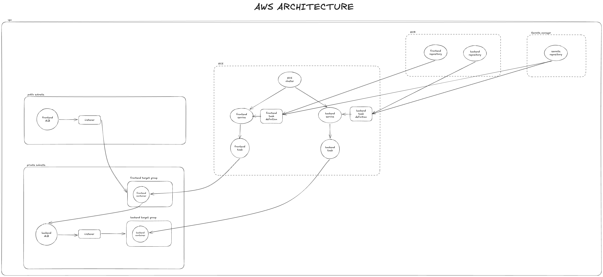
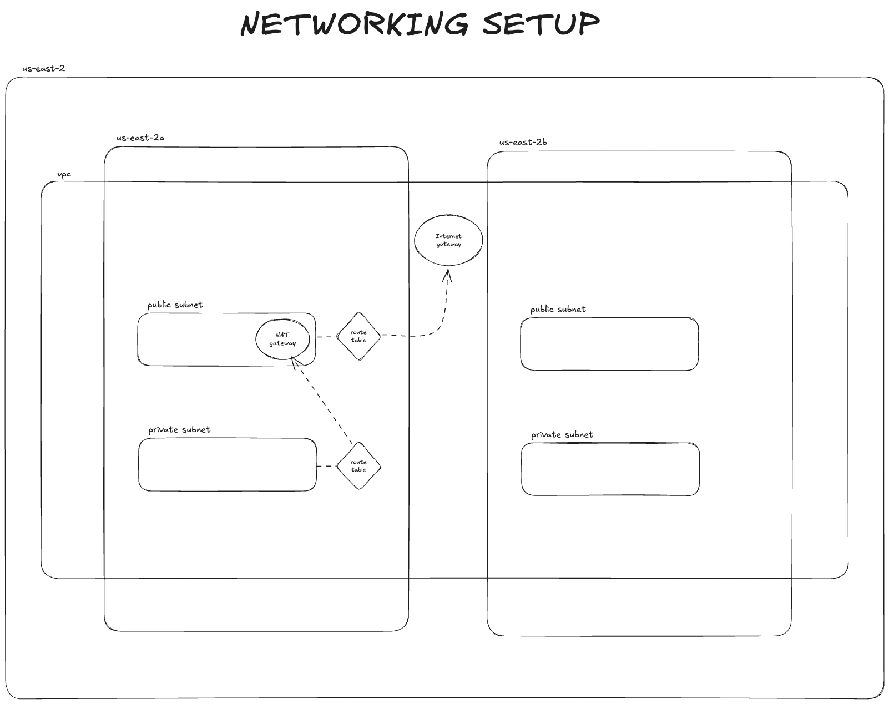
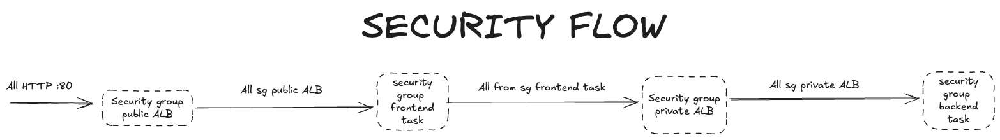

# AWS Architecture (Network + ECS + ALB + ECR + Secrets Manager)

This repository deploys a multi-service architecture on **AWS ECS (Fargate)**:

- **Frontend service** (publicly accessible) behind a **public Application Load Balancer (ALB)**
- **Backend service** (private) behind an **internal/private ALB**
- Container images stored in **ECR**
- Secrets stored in **AWS Secrets Manager**
- Tasks run in **private subnets** and reach AWS services / internet via **NAT Gateway**

---

## High-level diagram

---

## Networking setup

The deployment uses a **single VPC** spanning **two Availability Zones**.

### Key ideas

- **Public subnets**
  - Contain the **public ALB**
  - Contain the **NAT Gateway** (with an Elastic IP)
  - Route to the **Internet Gateway (IGW)**

- **Private subnets**
  - Run **ECS tasks** (frontend + backend)
  - Host the **internal/private ALB** (for backend)
  - Default route goes to **NAT Gateway** for outbound traffic (pulling images, calling APIs, etc.)

---

## Load balancing & traffic flow

There are **two ALBs**:

1. **Frontend ALB (public)**
   - Accepts traffic from the internet (HTTP only)
   - Forwards to **frontend target group** (ECS tasks in private subnets)

2. **Backend ALB (internal/private)**
   - Only reachable inside the VPC
   - Forwards to **backend target group** (ECS tasks in private subnets)

### End-to-end request path

1. User → **Public Frontend ALB**
2. Frontend ALB → **Frontend ECS tasks**
3. Frontend task → **Private Backend ALB**
4. Backend ALB → **Backend ECS tasks**

---

## Security model (security groups)

This is the “allowed traffic chain” in plain English:

### Typical rule intent

- **Public ALB SG**
  - Ingress: `0.0.0.0/0` on `:80`
  - Egress: to **frontend task SG** on the frontend container port

- **Frontend task SG**
  - Ingress: from **public ALB SG** on the frontend container port
  - Egress: to **private backend ALB SG** on the backend listener port (and any other required outbound)

- **Private backend ALB SG**
  - Ingress: from **frontend task SG** on the backend listener port
  - Egress: to **backend task SG** on the backend container port

- **Backend task SG**
  - Ingress: from **private backend ALB SG** on the backend container port
  - Egress: outbound via NAT (for external APIs / AWS services), plus any internal dependencies

> The important principle is: **only the component immediately “in front” is allowed to talk to the next one.**
> This prevents direct internet access to tasks and prevents the frontend from bypassing the backend ALB.

---

## ECS layout

- One **ECS Cluster**
- Two **ECS Services**
  - `frontend-service`
  - `backend-service`
- Each service runs tasks from its own **task definition**
- Each service is registered to its own **target group**
- Services use `awsvpc` networking (each task gets its own ENI; each ENI has its own security group)

---

## Container images (ECR)

- `frontend` image → stored in **ECR frontend repository**
- `backend` image → stored in **ECR backend repository**
- ECS task definitions reference the image tags/digests from ECR

---

## Secrets (AWS Secrets Manager)

Secrets (API keys, tokens, etc.) are stored in **Secrets Manager** and injected into ECS tasks at runtime.

Common pattern:
- ECS task definition uses `secrets = [{ name = "...", valueFrom = "arn:...:KEY::" }]`
- App reads secrets via environment variables inside the container

> This keeps secrets **out of Git**, **out of Docker images**, and avoids baking secrets into the build.

---

## Health checks

There is a single layer of health checks at the target groups:

- **ALB target group health check**
  - Used for routing traffic only to healthy tasks

No **ECS container health check** service is always behind the **private ALB** and to avoid a double effort.
